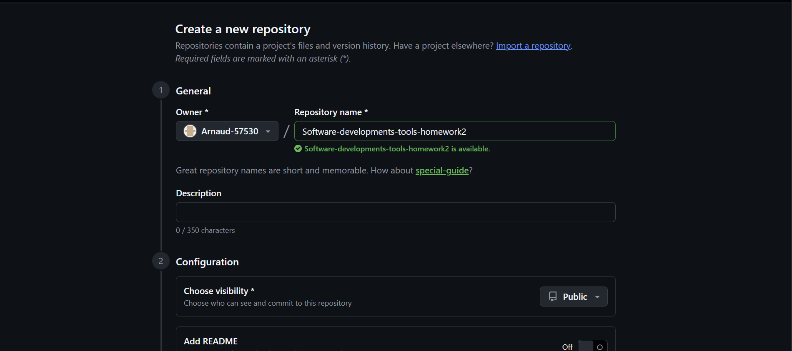
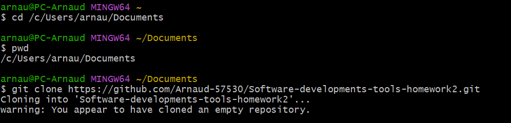
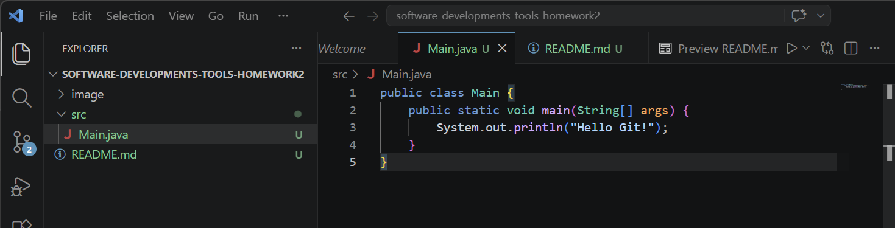
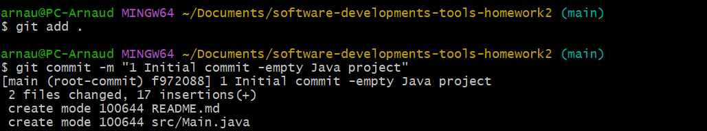
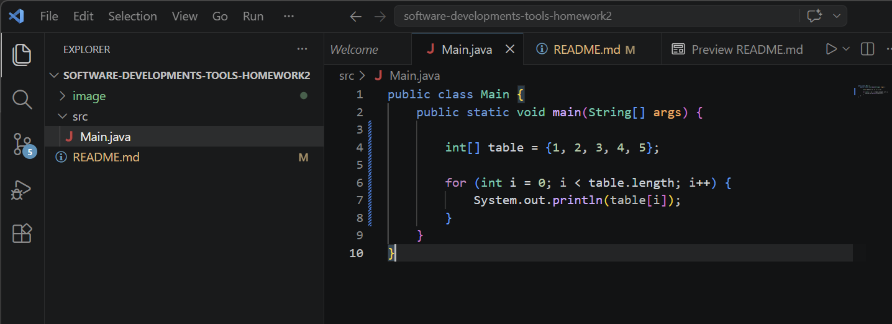
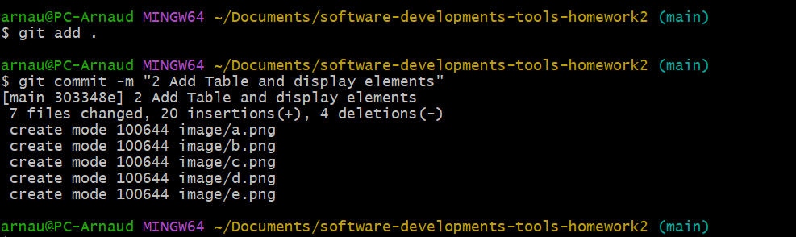
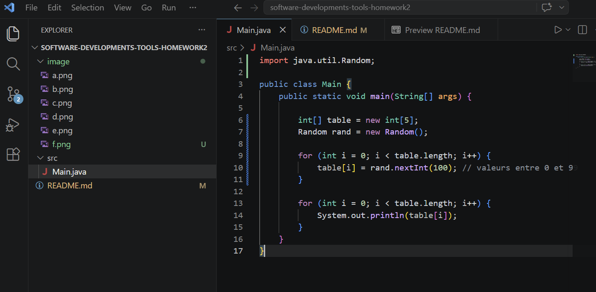
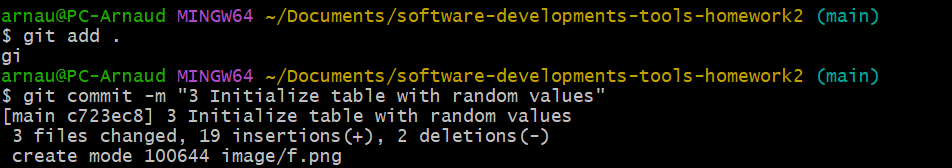

# Software Development Tools - Homework 2

## a) Create remote repository

Short description...

## b) Clone repository

Used git clone

## c) Create empty project

Created a simple Java project with a Main class.

## d) Commit project

Initial commit using:
git add .
git commit -m "Initial commit - empty Java project"

## e) Add simple code (table)

Added an array and displayed its elements.

## f) Commit changes

## g) Initialize table with random values

Initialized array with random values.

## h) Commit changes

