# Software Development Tools - Homework 2

## a) Create remote repository

Short description...

## b) Clone repository

Used git clone

## c) Create empty project

Created a simple Java project with a Main class.

## d) Commit project

Initial commit using:
git add .
git commit -m "Initial commit - empty Java project"

## e) Add simple code (table)

Added an array and displayed its elements.

## f) Commit changes

## g) Initialize table with random values

Initialized array with random values.

## h) Commit changes

## i) Sort table elements

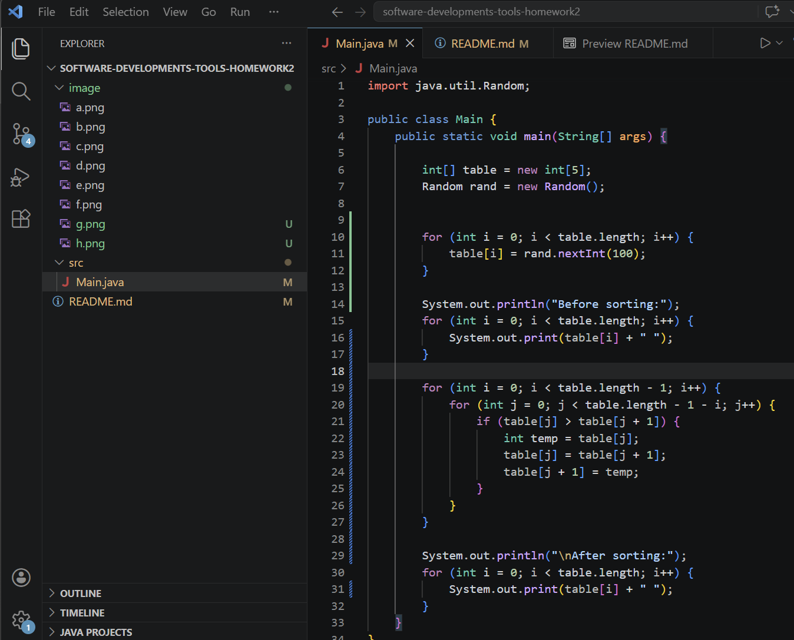

Implemented bubble sort algorithm.

## j) Commit changes

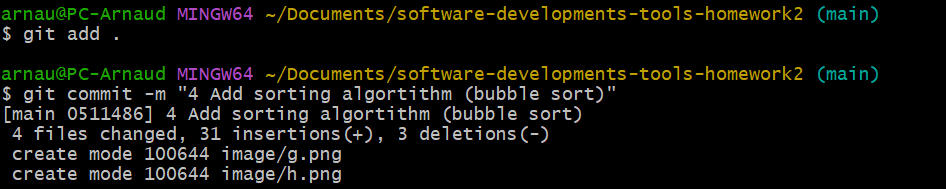

## k) Look at code history (git log)

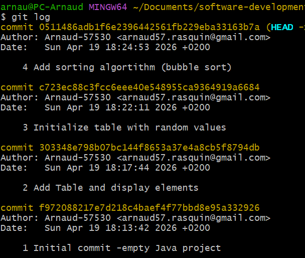

Displayed commit history using:
git log

## l) Look at code annotations (git blame)

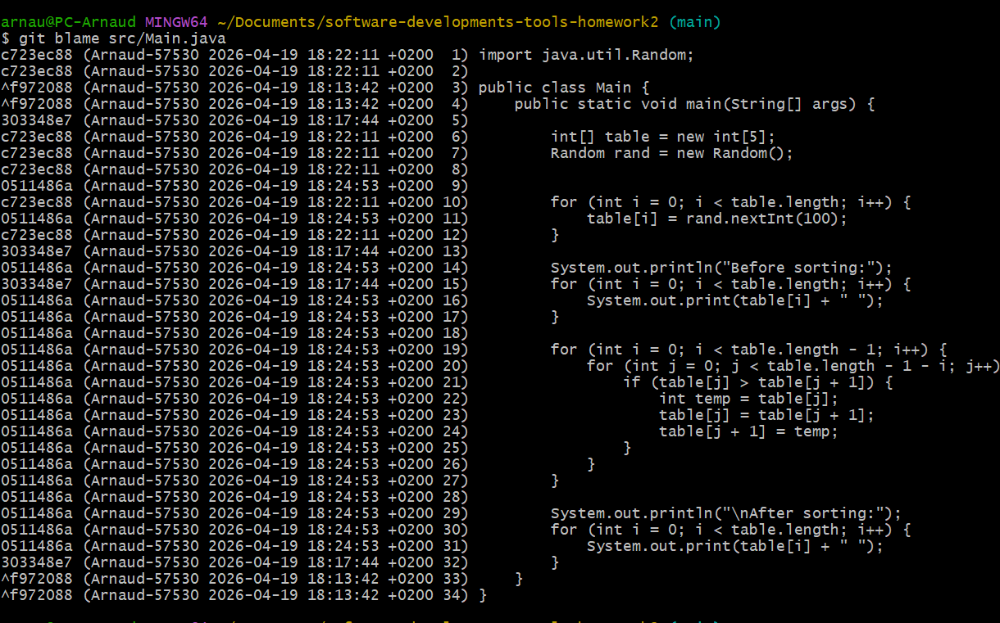

Displayed code annotations using:
git blame src/Main.java

## m) Checkout different revisions

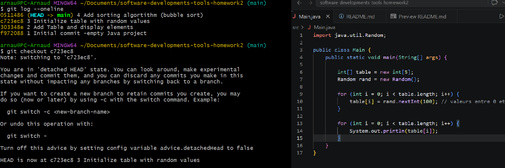

Switched to an older commit using:
git checkout <commit_hash>

Then returned to the main branch:
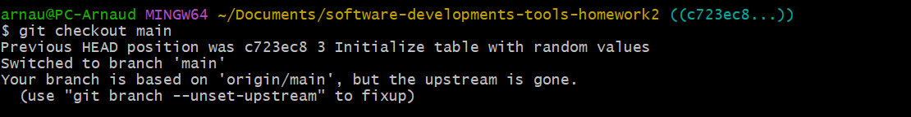

## n) Add changes without commit

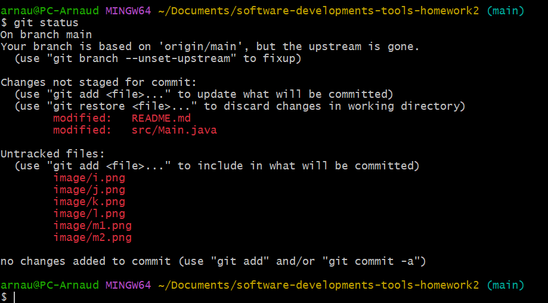

Modified the code without committing changes.

Used:
git status

## p) Push project to remote repository

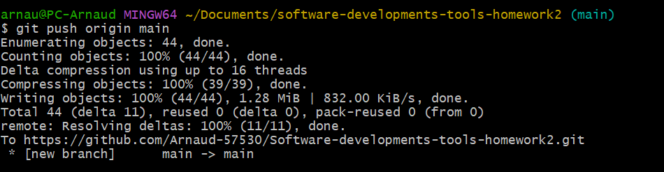

Pushed project to GitHub using:
git push origin main

## r) Delete local project

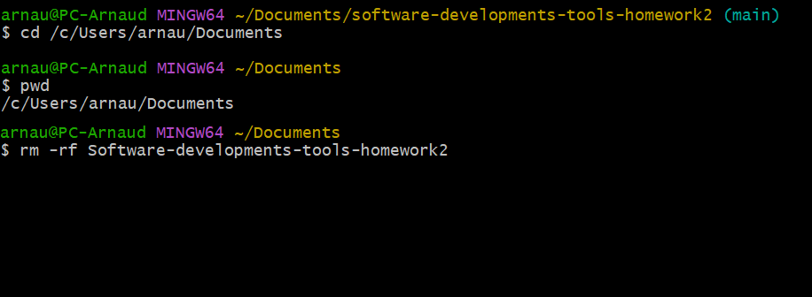

Deleted local repository using:
rm -rf software-developments-tools-homework2

## s) Clone project from remote repository

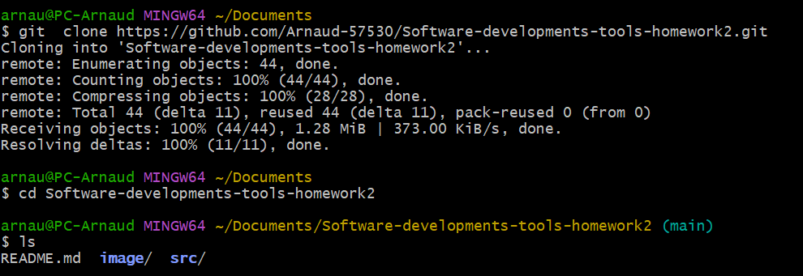

Cloned project from GitHub using:
git clone https://github.com/Arnaud-57530/Software-developments-tools-homework2.git

## t) Create tag and switch between versions

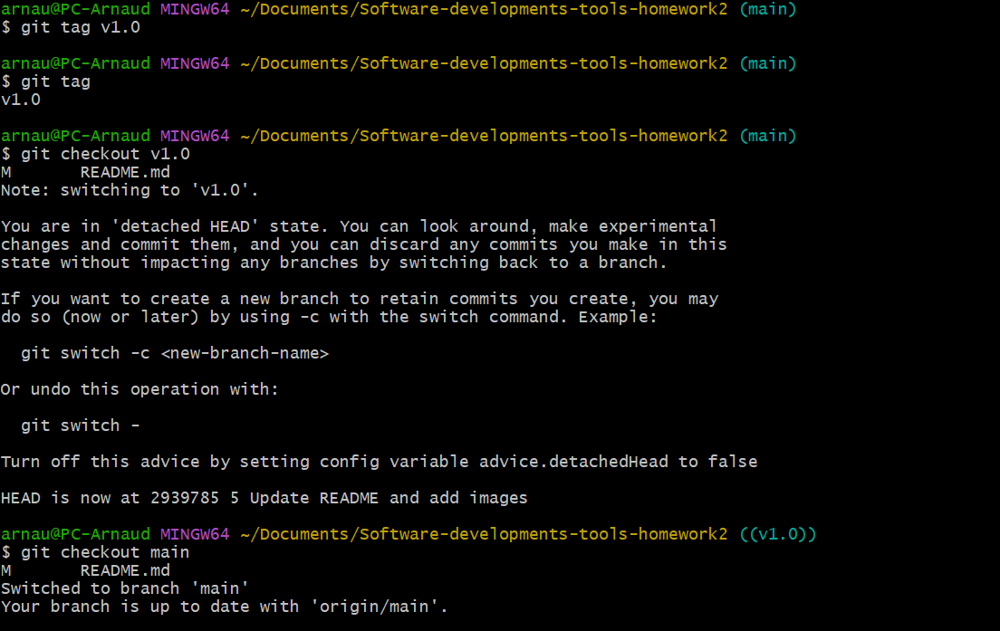

Created tag:
git tag v1.0

Switched to tag:
git checkout v1.0

Returned to main branch:
git checkout main

## u) Create new branch + w) Switch to branch

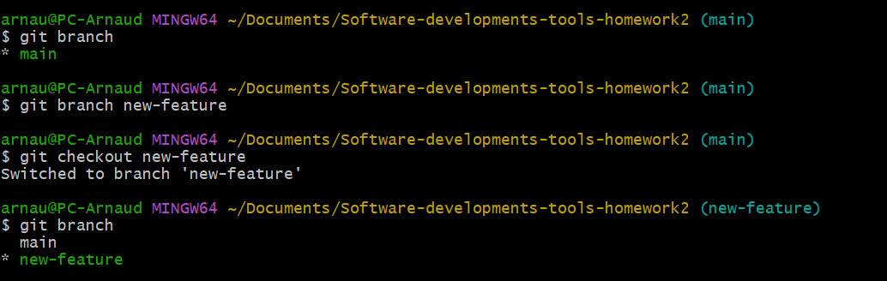

Created new branch from main:
git branch new-feature

Switched to branch:
git checkout new-feature

## x) Improve code in branch

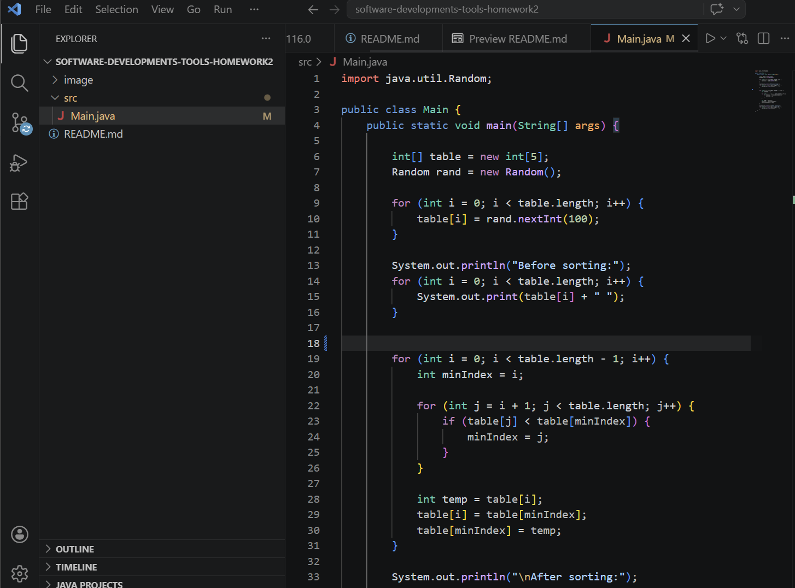
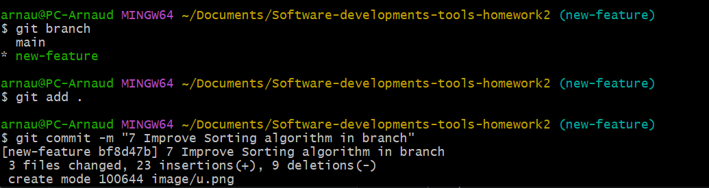

Changed the sorting algorithm in branch `new-feature` from bubble sort to selection sort.

## y) Merge branch into main

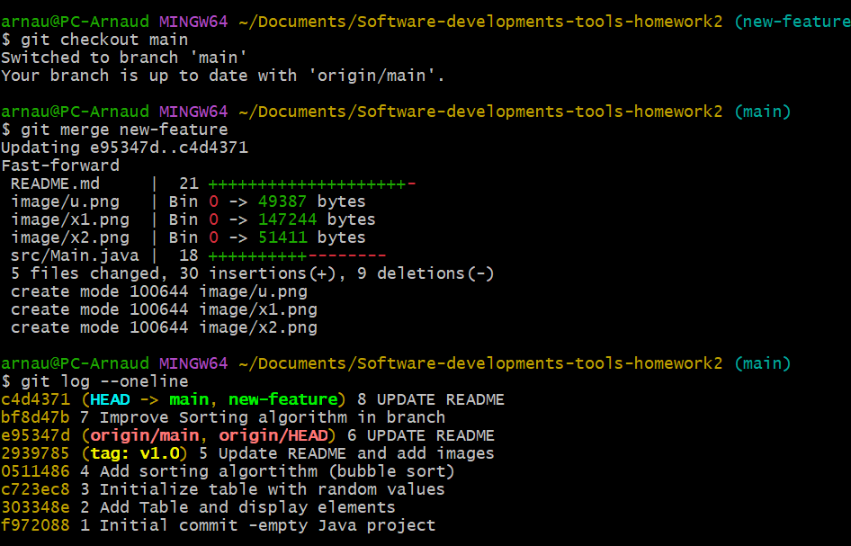

Merged branch `new-feature` into `main` using:
git merge new-feature